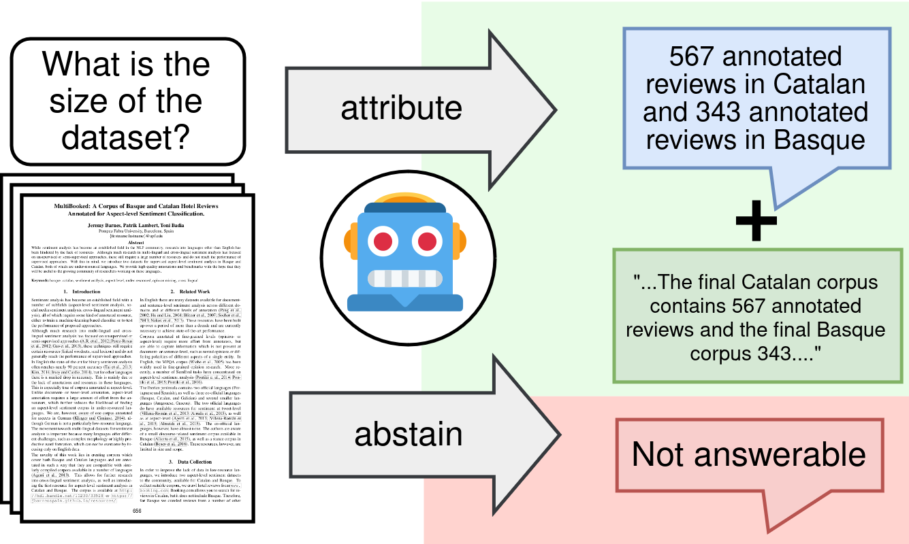

# Attribute or Abstain: Large Language Models as Long Document Assistants



Jan Buchmann, Xiao Liu, Iryna Gurevych

[Ubiquitous Knowledge Processing Lab](https://www.informatik.tu-darmstadt.de/ukp/ukp_home/index.en.jsp) (UKP), TU Darmstadt

This repository contains the evaluation and analysis code for LAB, the **L**ong document **A**ttribution **B**enchmark introduced in the paper "Attribute or Abstain: Large Language Models as Long Document Assistants" (Arxiv ink will follow soon). 

To download the pre-formatted datasets, please see [here](https://tudatalib.ulb.tu-darmstadt.de/handle/tudatalib/4276.2).

## Setup

### Data

It is assumed that there is a data folder at `../data` (relative to this repository).
This folder should contain the following:
```
attribution
    datasets <- Datasets to test attributability evaluation models
    results <- Test results for attribution evaluation models
datasets <- Datasets to evaluate attribution capabilities of LLMs 
openai_cost_tracking <- Only needed when using openAI models
results <- All predictions, results and models will be stored here
tensorboard <- Logging
```

You can simply download the data from [here](https://tudatalib.ulb.tu-darmstadt.de/handle/tudatalib/4276.2), unzip it and place it in the same folder as this repository. If you want to use a different location, adapt the paths in `config/location/local`

### Install requirements
```bash
conda create -n lab_env python=3.11
conda activate lab_env
# There is a requirements conflict because we are using cuda 11.8,
# so  installation is done in this bash script
bash install.sh

# Download NLTK punkt tokenizer
# Open python shell
python
>>> import nltk
>>> nltk.download('punkt')
```

## Basic Usage

The `run_evaluation.py` script serves as the entry point for all experiment runs. All important hyperparameters are controlled by the files in the `config/` directory. See below for an explanation of the config and the most important parameters.

To evaluate the Longchat on the dev set of QASPER, you can run

```bash
python run_evaluation.py task=qasper model=longchat-7b-v1.5-32k use_dev_as_test_data=True
```

## The Config

Hyperparameter management is done using the [hydra](https://hydra.cc/) package. All hyperparameters are documented in the corresponding classes in the `config_lib/` directory. These classes document all config parameters and serve as typecheckers for the input values.

The default values of the parameters can be seen in the yaml files in the `config/` directory. The defaults can be overridden by adding `<param_name>=<param_value>` to the command.

### Important config parameters

All config parameters are documented in the respective module in the `config_lib/` directory. 

`description`: A free text description of the experiment
`model`: The model to use. See `config/model` for all available models.
`task`: The task to evaluate on. See `evaluation/tasks` for all available tasks.
`required_aspects`: str, one of
- "answer_and_segments" (used when doing `citation`)
- "answer_only" (used when doing `post-hoc` and `retrieve-then-read`)
- "segments_only"
`do_train`: Whether to fine-tune the model on the train set of the task.
`use_dev_as_test_data`: Whether to evaluate on the dev data.
`use_first_n_test_instances`: Determine the number of instances to evaluate on. If set to -1, all available test / dev instances are used.

## Running Experiments

### Post hoc 
To run post hoc experiments, we first run LLM inference, and then do post hoc evidence retrieval
```bash
# Run inference on QASPER with GPT-4, using the first 100 instances from the test set
# This will produce a new folder in the results directory, named with a unique hash
python run_evaluation.py description='post_hoc' task=qasper model=gpt-4-turbo-128k use_dev_as_test_data=False required_aspects=answer_only use_first_n_test_instances=100

# Get the hash and evaluate. This will do post hoc retrieval and evaluate attributability
python evaluate_predictions.py <hash> --post_hoc_extract
```

### Retrieve-then-read
```bash
# Run inference on QASPER with GPT-4, using the first 100 instances from the test set
# This will produce a new folder in the results directory, named with a unique hash
python run_evaluation.py description='post_hoc' task=qasper model=gpt-4-turbo-128k use_dev_as_test_data=False required_aspects=answer_only use_first_n_test_instances=100 do_retrieve_then_read=short

# Get the hash and evaluate. This will evaluate attributability
python evaluate_predictions.py <hash>
```

### Citation
```bash
# Run inference on QASPER with GPT-4, using the first 100 instances from the test set
# This will produce a new folder in the results directory, named with a unique hash
python run_evaluation.py description='post_hoc' task=qasper model=gpt-4-turbo-128k use_dev_as_test_data=False required_aspects=answer_and_segments use_first_n_test_instances=100

# Get the hash and evaluate. This will evaluate attributability
python evaluate_predictions.py <hash>
```

### Reduced Post Hoc
```bash
# Run inference on QASPER with GPT-4, using the first 100 instances from the test set
# This will produce a new folder in the results directory, named with a unique hash
python run_evaluation.py description='post_hoc' task=qasper model=gpt-4-turbo-128k use_dev_as_test_data=False required_aspects=answer_and_segments use_first_n_test_instances=100 do_retrieve_then_read=long

# Get the hash and evaluate. This will do post hoc retrieval and evaluate attributability
python evaluate_predictions.py <hash> --post_hoc_extract
```

### Reduced Citation
```bash
# Run inference on QASPER with GPT-4, using the first 100 instances from the test set
# This will produce a new folder in the results directory, named with a unique hash
python run_evaluation.py description='post_hoc' task=qasper model=gpt-4-turbo-128k use_dev_as_test_data=False required_aspects=answer_and_segments use_first_n_test_instances=100 do_retrieve_then_read=long

# Get the hash and evaluate. This will evaluate attributability
python evaluate_predictions.py <hash>
```

## Running Attribution Evaluation Models on Test data
```bash
python evaluate_attribution.py --description 'test' --model_name true_nli --task_name qasper --partition dev --is_csv
```

## Adding new tasks / datasets

- Add new datasets to `../data/datasets`. Create a new directory `<dataset_name>`. In that new directory, create one directory `<dataset_name>_itg` for the dataset in itg format and optionally another directory for the raw dataset.
- Add a new `<task-name>.py` file to `evaluation/tasks`. Implement the required task class (`...Task`) in that file, inheriting from the `BaseTask` classe in `evaluation/common.py`. You can use the other tasks for reference
- If your dataset exists as individual json files, you might want to use `evaluation/common/SingleFileDataset` to implement data loading
- Add your new classes to `run_evaluation.py`
- Add new yaml file to `config/tasks` that specifies hyperparameters for the task. If new hyperparameters are necessary, add them to `config_lib/base_task/BaseTaskConfig`
- Add new `task_explanation` and `example` to `config/prompts.py`

## Logging

To view the logs in your browser, follow these steps: 

1. Install tensorboard on your local machine `pip install tensorboard`
2. Set logging directory in `config/location/local`
3. Start tensorboard `tensorboard --logdir /path/to/logging/dir`

## Structure of this repository
```text
├── attribution_eval                # Functions and classes for attributability evaluation
    ├── attribution_dataset.py      # Contains code to construct claims from responses for attributability evaluation
    ├── attribution_model.py        # Contains code for the attributability evaluation models
    └── util.py                     # utility functions 

├── config                          # contains yaml files with default values for hydra config parameters
    ├── location                    # Default paths for models, result files, predictions, datasets, ...
    ├── model                       # defaults for currently implemented models
    ├── task                        # defaults for currently implemented tasks
    ├── config.yaml                 # top-level config file with general parameters
    └── prompts.yaml                # Hard coded prompt elements
    
├── config_lib                      # contains config classes for documentation and type checking

├── dataset_creation
    ├── make_attributed_dataset.py  # Contains code to automatically annotate evidence via post hoc retrieval (Used for GovReport in the paper).

├── evaluation
    ├── tasks                       # Contains task classes that implement instance loading
    ├── callbacks.py                # Contains callbacks that are called during evaluation, important for storing predictions and logging
    ├── common.py                   # Base classes for tasks, instances, predictions. New tasks should inherit from these base classes.
    ├── metrics.py                  # Metrics for evaluation (e.g. Answer F1)
    ├── run.py                      # Contains run() which is called in run_evaluation.py
    ├── validator.py                # Basic implementation of evaluation loop.
    └── util.py                     # Utility functions for evaluation
    
├── models
    ├── api_lm.py                   # General implementation for API-served models (e.g. ChatGPT).
    ├── base_model.py               # Base class for models
    ├── causal_lm.py                # General implementation of decoder-only models that can be accessed through Huggingface's AutoModelForCausalLM class.
    ├── oracle.py                   # A simple oracle model that returns the ground truth as predictions. Can be useful for debugging.
    ├── retrieve.py                 # Retrievers for reducing, retrieve then read and post hoc
    └── seq2seq_lm.py               # General implementation of encoder-decoder LMs.

├── structformer
    ├── collation_utils.py          # Helper functions for data collation
    ├── example_formatting.py       # Helper functions for formatting of in-context examples.
    ├── format_enforcement.py       # Creates functions for constrained generation
    ├── input_preparation.py        # Functions for data processing
    ├── input_sequence.py           # Functions to produce a single string from an Intertext Document
    └── sequence_alignment.py       # Functions to map between tokenized ITGs and ITGs.
    
├── evaluate_predictions.py         # Main script to evaluate runs, e.g. for attributability. Post hoc retrieval is also done here
├── evaluate_attribution.py         # Main script to evaluate attributability evaluation models
├── install.sh                      # Script to install dependencies
└── run_evaluation.py               # Main script for experiments


```

## Citation

If you use our data or code in your research, please cite

TODO: add citation

## Disclaimer

This repository contains experimental software and is published for the sole purpose of giving additional background details on the respective publication.